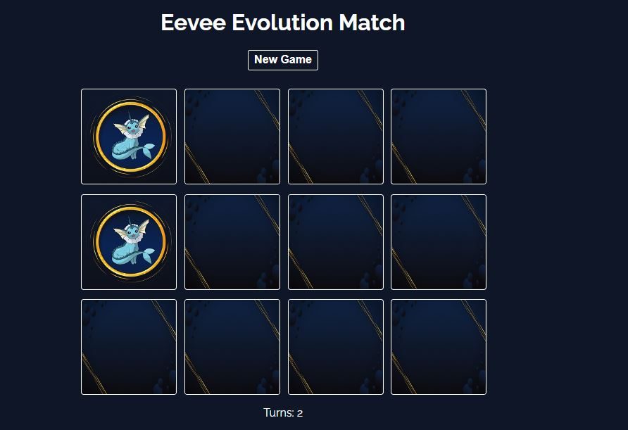

## Eevee Memory

This project is a memory game involving 6 different cards that are all the evolutions of the pokemon "Eevee". These pokemons are Espeon, Flareon, Leafeon, Umbreon, Jolteon and Vaporeon.

There are a total of 12 cards in this game so every card has only one unique match. This project also keeps track of the number of turns the user takes to complete the game with the best possibility being 6 turns.

The card components were made with the help of my friend who provided me with the following frame.

## Preview 

If 2 consecutive choices match, the card will remain flipped (like vaporeon) otherwise the cards will return to their back portion (flareon and jolteon did not match) after a 1 second delay. Flipping animation is performed for every choice. 
